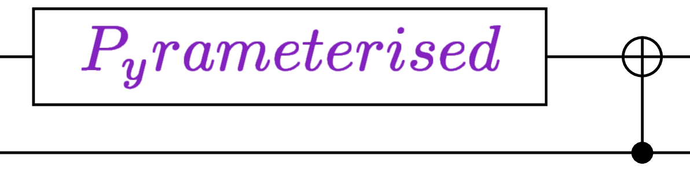
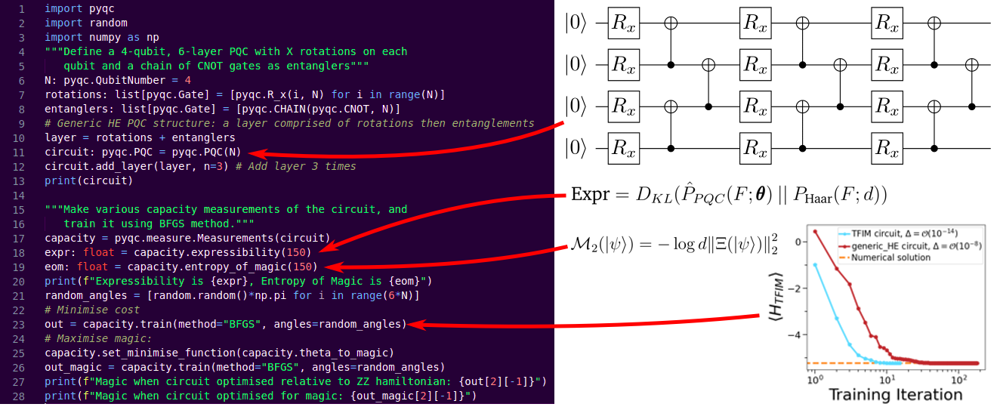
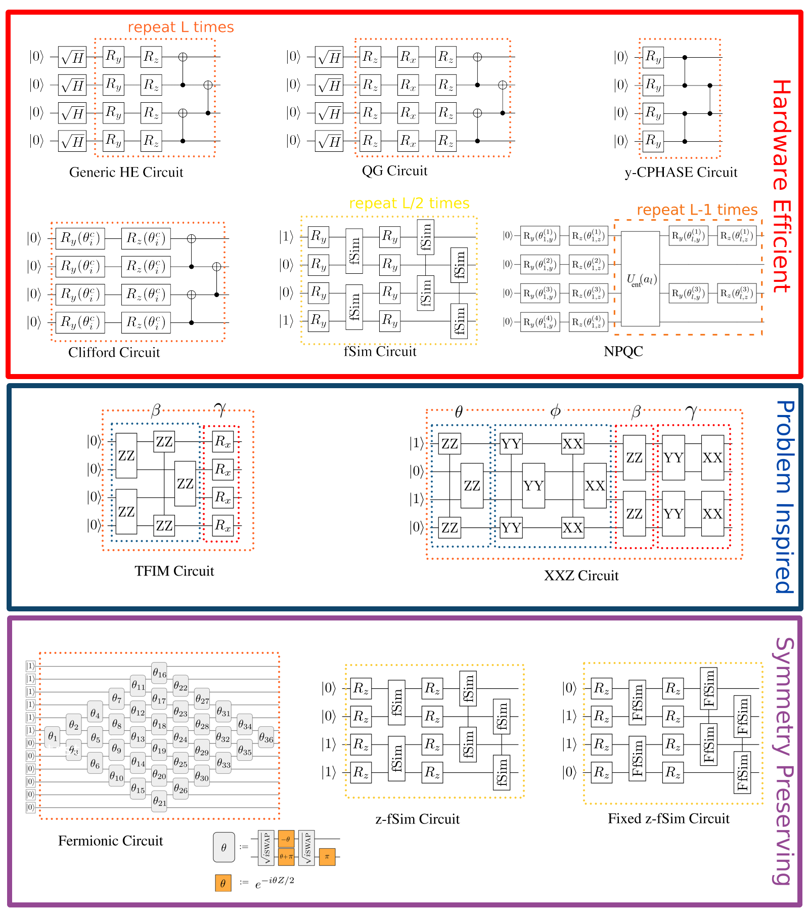

<h1 align="center">

</h1><br>

## About:
`pyramaterised` is a framework for creating and measuring Parameterised Quantum Circuits (PQCs)
in Python, by acting as a wrapper around the [`QuTIP` library](https://qutip.org/). A series of PQCs from the
literature have been implemented using the framework alongside various collated capacity
measures.

<h1 align="center">

</h1>

## Usage:
Simply run in your current (virtual) environment:
```
pip install pyramaterised
```
Check out `example.py` or `tests.py` for examples of the framework in action.

## Circuits:

<h1 align="center">

</h1>

A diagram of some of the circuits available in the library (custom circuits can be easily constructed). NPQC diagram from [[1]](https://arxiv.org/abs/2107.14063), XXZ and TFIM circuits adapted from [[2]](https://journals.aps.org/prxquantum/abstract/10.1103/PRXQuantum.1.020319) and fermionic circuit diagram from [[3]](https://www.science.org/doi/10.1126/science.abb9811).

## Capacity measures:
Capacity measures tell you how well an aspect of a PQC is performing, *e.g,* entanglement measures the amount of entanglement generated by the circuit, expressibility describes how well an *N* qubit circuit explores the *N* qubit Hilbert space.
- [Entanglement](https://arxiv.org/abs/quant-ph/0305094)
- [Expressibility](https://arxiv.org/abs/1905.10876)
- [QFIM](https://arxiv.org/abs/1909.05074)
- [Effective Quantum Dimension](https://journals.aps.org/prxquantum/abstract/10.1103/PRXQuantum.2.040309)
- [Rényi Entropy of Magic](https://arxiv.org/pdf/2106.12587)
- [GKP Magic](https://arxiv.org/abs/2109.13018)
- Effective Hilbert Space - new measure based on finding the subspace that minimises a circuit's expressibility.

## Technical decisions:
- Python: de-facto scientific programming language, interoperability with QuTIP important.
- Object oriented: circuits being comprised of layers of gates with similar shared behaviours seemed a good fit.
- Designed to allow users to create PQCs more easily than writing every gate by hand in QuTIP or similar program.

## Acknowledgements
Thanks to the `numpy`, `scipy`, `matplotlib` and `QuTIP` libraries.
Thanks to F. Roberts and T. Haug for their help.

